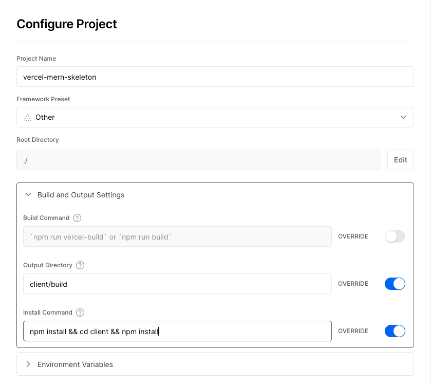
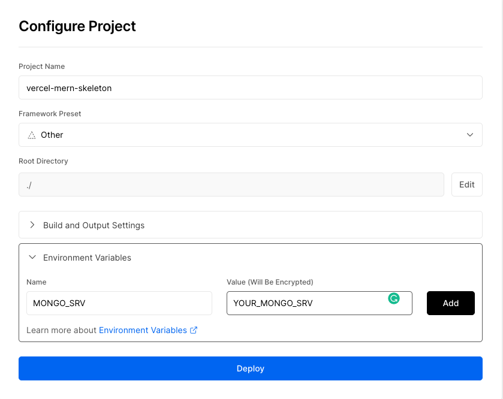

# How to use the skeleton

## Get the code

You have 3 options for getting the code:

- Clone the repo
- Download the zip file
- **_recommended_** Click the "Use this template" button

## Install the dependencies

Unfortunately, the only way I could get this to work is having two `package.json`, and therefore 2 sets of `node_modules`. Here's what you need to do after you have the code on your machine:

1. `cd` into the skeleton directory.
2. `npm install` to install the dependencies for the Express server.
3. `cd client && npm install` to install the dependencies for the React frontend.

## Add your MongoDB connection string

Let's get the database all setup!

1. Follow [these instructions](https://www.mongodb.com/basics/clusters/mongodb-cluster-setup) to setup your MongoDB cluster. We're going to keep your credential string safe in a `.env` file.
2. Create a `.env` file in the root of the project.
3. Add the following line to the `.env` file, replacing `YOUR_CONNECTION` with your connection string: `MONGO_SRV=YOUR_CONNECTION`

## How to run the app locally

Now that we have the database, let's test out the app in development mode.

1. From the root of the project, run `npm run dev` to start both the Express server and the React frontend. When you make changes to any files, your app will automatically update for you, so no need to rerun this command.
2. Open [http://localhost:3000](http://localhost:3000) to view the skeleton in the browser. You should see a spinning donut!
3. Open [http://localhost:8000/api/](http://localhost:8000/api/) to test the express server. You should see a JSON object with a message: `{message: "Hello World"}`

## What to change in the skeleton to make it your own

There's not too much you need to do besides adding all your custom code. Here's a list of things you should change:

1. Change the name of the app in `package.json`
2. Change the page title in `client/public/index.html`
3. Change the favicon in `client/public/favicon.ico`
4. _[Recommended]_ Add your own logos in `client/public/logo192.png` and `client/public/logo512.png`
5. Build out your API by adding routers to `server/` and importing them in `api/index.ts`
6. Build out your frontend by adding pages and components to `client/src/components` and importing them in `client/src/App.tsx`
7. Happy hacking!

## How to deploy to Vercel

Let's deploy to vercel!

1. Push your updated code to your own repo.
2. Create an account on [Vercel](https://vercel.com/).
3. Create a new project and click the "Continue with GitHub" button to link to your repo.
4. Use the following settings for your project:
   - **Output Directory:** `client/build`
   - **Install Command:** `npm install && cd client && npm install`
     
5. Add the following environment variables:
   - `MONGO_SRV` - your MongoDB connection string
     
6. Click "Deploy" and wait for your app to deploy!

## You can check out this skeleton [here](https://vercel-mern-skeleton.vercel.app/)
